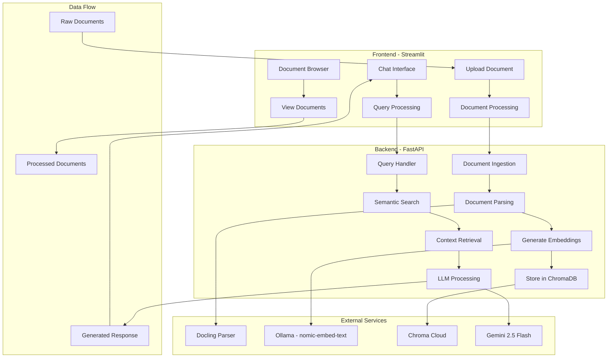

# 📚 Notebook LLM - Complete Multimodal Research Assistant

A **locally-deployable, production-ready, multimodal research assistant** enabling Retrieval-Augmented Generation (RAG) for complex documents (text, images, tables, and code) using advanced LLM and vision models.

---

## 🚀 Features

- **Advanced Document Ingestion**
  - Support for PDF, DOCX, PPTX, XLSX, HTML, CSV, Jupyter Notebooks, images, and more via Docling/LangChainDocling.
- **Multimodal Understanding**
  - Handles text, image, and tabular information, extracting semantic relationships.
- **Powerful RAG Search**
  - Unified vector database (Chroma Cloud) for hybrid search across modalities.
- **On-the-fly Summarization**
  - Custom Gemini 2.5 Flash LLM summarization for text, tables, and images.
- **Local Embeddings**
  - Fast, secure, and cost-effective embedding generation with Ollama's `nomic-embed-text` model.
- **LLM-augmented Query Answering**
  - User's question and contextually relevant document chunks are synthesized for human-like answers.
- **User-Centric Streamlit Interface**
  - Easy document management, semantic chat, and browsing in your browser.
- **Local-first, Privacy-focused**
  - All processing and storage happens on your infrastructure.

---

## 🗂 Folder Structure

```
notebook-llm-multimodal-rag/
│
├── backend/
│   ├── main.py              # FastAPI app, all routes here
│   ├── ingest.py            # Helpers for document ingestion/parsing
│   ├── query.py             # Helpers for querying/search
│   ├── parsing.py           # Dockling parsing integration
│   ├── embeddings.py        # Ollama embedding logic
│   ├── vision.py            # Gemini 2.0 Flash integration
│   ├── chroma_db.py         # Chroma Cloud database interaction
│   ├── summarization.py     # Table/image/text summarization logic
│   ├── utils.py             # Backend utility functions
│   └── schemas.py           # Pydantic models for requests/responses
│
├── frontend/
│   ├── app.py               # Main Streamlit entrypoint/UI
│   ├── components.py        # All UI component functions
│   └── utils.py             # Helper functions (API calls, etc.)
│
├── uploaded_data/           # Storage for user-uploaded documents
├── .env                     # Environment variables (template)
├── requirements.txt         # All Python dependencies for both FE+BE
├── README.md                # Project overview and setup instructions
└── .gitignore              # Standard Python ignores
```

## 🔄 System Architecture & Flow

The following diagram illustrates the complete system architecture and data flow:



### System Components

1. **Document Processing Pipeline**
   - Documents are uploaded through the Streamlit interface
   - Backend processes them using Docling for parsing
   - Ollama generates embeddings for text chunks
   - Embeddings and metadata are stored in Chroma Cloud

2. **Query Processing Pipeline**
   - User queries enter through the chat interface
   - Backend performs semantic search in ChromaDB
   - Retrieved context is processed with Gemini 2.5 Flash
   - Generated responses are displayed in the chat UI

3. **Document Management**
   - Documents are stored locally in uploaded_data/
   - Metadata and embeddings in Chroma Cloud
   - Browse interface for document management

4. **External Service Integration**
   - Docling: Advanced document parsing
   - Ollama: Local embedding generation
   - Chroma Cloud: Vector database
   - Gemini 2.5 Flash: LLM processing

---

## ⚙️ Setup Instructions

### 1. **Clone the Repository**

```bash
git clone <your-repo-url>
cd notebook-llm-multimodal-rag
```

### 2. **Install Python dependencies**

```bash
pip install -r requirements.txt
```

### 3. **Configure Environment Variables**

- Copy `.env.example` to `.env` (or create `.env`)
- Fill in:
  - `CHROMA_DB_API_KEY`
  - `CHROMA_DB_TENANT_ID`
  - `CHROMA_DB_DATABASE_ID`
  - `GEMINI_API_KEY` (Google Gemini/GenAI API)
  - `OLLAMA_HOST` (default: `http://localhost:11434`)

Example:
```env
CHROMA_DB_API_KEY=your-chroma-api-key
CHROMA_DB_TENANT_ID=your-tenant-id
CHROMA_DB_DATABASE_ID=your-database-id
GEMINI_API_KEY=your-google-gemini-api-key
OLLAMA_HOST=http://localhost:11434
```

- Ensure that an `uploaded_data/` folder exists (usually auto-created).

### 4. **Start the Backend (FastAPI)**

```bash
uvicorn backend.main:app --reload
```
- Runs at [http://localhost:8000](http://localhost:8000)
- Open in browser for FastAPI auto-docs (Swagger/OpenAPI)

### 5. **Start the Frontend (Streamlit)**

In a new terminal:
```bash
streamlit run frontend/app.py
```
- Runs at [http://localhost:8501](http://localhost:8501)

---

## 🖇️ Usage Overview

### Uploading and Querying Documents

1. Open [http://localhost:8501](http://localhost:8501)
2. Go to **"Upload Document"**, choose your file (PDF, DOCX, PPTX, etc.), and submit.
3. Browse or chat:
   - **"Browse Documents"** gives you an overview of uploaded files.
   - **"Chat/Query"** lets you ask questions, with LLM-generated answers and contextual evidence from the documents.

### Supported Filetypes for Ingestion

- PDF
- DOCX
- PPTX
- XLSX, CSV
- Markdown, HTML
- Images (PNG, JPG)
- Jupyter Notebooks (.ipynb)
- Others supported via Docling

---

## 🔍 Technical Stack

- **Backend:** FastAPI, LangChain, LangChain-Community, Docling, langchain-docling, Chroma Cloud, Ollama
- **Frontend:** Streamlit
- **Vision/LLM:** Gemini 2.5 Flash via LangChain-Google-GenAI
- **Embeddings:** Ollama (`nomic-embed-text`)
- **Vector DB:** Chroma Cloud (trychroma.com)
- **Document Parsing:** Docling + LangChain integration
- **Orchestration & Inference:** LangChain chains, custom prompts

---

## 📝 Customization & Extensions

- Add more supported filetypes or chunking strategies in `backend/parsing.py`
- Tweak summary prompts or LLM parameters in `backend/summarization.py`
- Add authentication (e.g., via FastAPI/Streamlit) for multi-user deployments
- Extend frontend to add user upload history, filtering, or advanced search
- Plug in new LLM models (OpenAI, Claude, etc.) as needed

---


